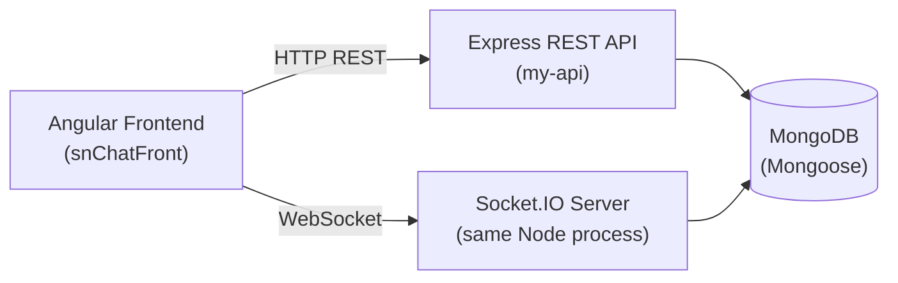
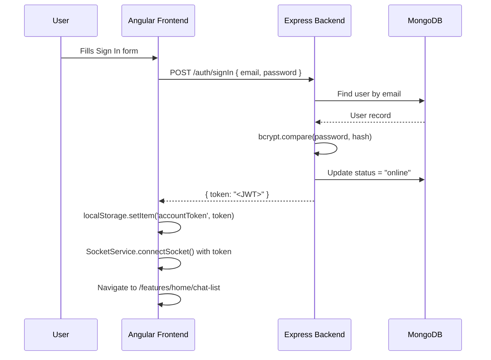
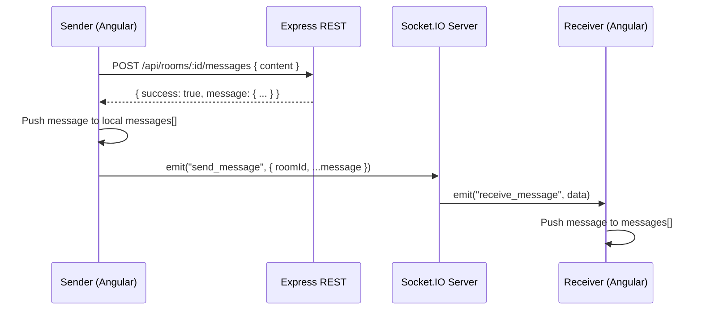

# chatApp — Project Documentation

> A full-stack real-time chat application built with **Node.js / Express / Socket.IO** on the backend and **Angular** on the frontend, deployed to GitHub Pages (frontend) and a Node server (backend).

---

## Table of Contents

1. [Architecture Overview](#architecture-overview)
2. [Tech Stack](#tech-stack)
3. [Project Structure](#project-structure)
4. [Backend (`my-api`)](#backend-my-api)
   - [Entry Point — server.js](#entry-point--serverjs)
   - [Environment Variables](#environment-variables)
   - [Database Models](#database-models)
   - [REST API Reference](#rest-api-reference)
   - [Authentication Middleware](#authentication-middleware)
   - [Socket.IO Events](#socketio-events)
5. [Frontend (`snChatFront`)](#frontend-snchatfront)
   - [Module Architecture](#module-architecture)
   - [Routing](#routing)
   - [Components](#components)
   - [Services](#services)
   - [Guards](#guards)
   - [TypeScript Models (Interfaces)](#typescript-models-interfaces)
6. [Authentication Flow](#authentication-flow)
7. [Real-Time Messaging Flow](#real-time-messaging-flow)
8. [Deployment](#deployment)
9. [Environment Configuration](#environment-configuration)

---

## Architecture Overview



- The backend is a **single Node.js process** that runs both the Express REST API and the Socket.IO real-time server.
- The frontend is an Angular SPA that communicates over HTTP for data persistence and over WebSocket for real-time message delivery.
- JWT tokens authenticate **both** HTTP requests (via the `token` header) and WebSocket connections (via `socket.handshake.auth.token`).

---

## Tech Stack

| Layer | Technology |
|---|---|
| Frontend | Angular 17+, Socket.IO-client, PrimeNG (Table) |
| Backend | Node.js, Express 5, Socket.IO 4 |
| Database | MongoDB via Mongoose 8 |
| Auth | JSON Web Tokens (JWT) + bcryptjs |
| Image processing | Sharp (resize, WebP compress) |
| File upload | Multer (memory storage) |
| Dev tooling | Nodemon, Angular CLI, angular-cli-ghpages |
| Deployment | GitHub Pages (frontend), Node server (backend) |

---

## Project Structure

```
chatApp/
├── my-api/                   # Backend (Node.js / Express)
│   ├── server.js             # App entry point
│   ├── controllers/
│   │   ├── userController.js  # Auth + user management
│   │   └── chatController.js  # Rooms + Messages
│   ├── models/
│   │   ├── user.js
│   │   ├── room.js
│   │   ├── message.js
│   │   └── image.js
│   ├── routes/
│   │   ├── userRoutes.js
│   │   └── chatRoutes.js
│   ├── middleware/
│   │   └── auth.js           # JWT protectRoute middleware
│   ├── lib/
│   │   ├── db.js             # Mongoose connection
│   │   └── utils.js          # generateToken helper
│   ├── public/               # Static file serving
│   └── package.json
│
└── snChatFront/              # Frontend (Angular)
    └── src/
        └── app/
            ├── app.routes.ts
            ├── app.config.ts
            ├── features/
            │   ├── features-routing-module.ts
            │   ├── authentication/
            │   │   ├── sign-in/
            │   │   └── sign-up/
            │   └── home/
            │       ├── home.ts           # Shell + nav + sign-out
            │       ├── chat-list/        # List of conversations
            │       ├── conversation/     # Active chat window
            │       ├── account/          # User profile
            │       ├── search/           # Find & add users
            │       └── saved-chats/
            └── shared/
                ├── services/
                │   ├── authentication.service.ts
                │   ├── chat-list.service.ts
                │   ├── socket.service.ts
                │   └── utils.service.ts
                ├── guards/
                │   └── auth.guard.ts
                ├── models/
                │   ├── auth-models.ts
                │   ├── account-model.ts
                │   └── room-model.ts
                └── constants/
```

---

## Backend (`my-api`)

### Entry Point — [server.js](file:///c:/Users/HP/Desktop/Projects/chatApp/my-api/server.js)

[server.js](file:///c:/Users/HP/Desktop/Projects/chatApp/my-api/server.js) bootstraps the entire backend:

1. Loads [.env](file:///c:/Users/HP/Desktop/Projects/chatApp/my-api/.env) via `dotenv`.
2. Creates an Express app and wraps it in a native `http.Server`.
3. Attaches a `Socket.IO` server to the HTTP server with CORS configured for `localhost:4200` and the GitHub Pages origin.
4. Connects to MongoDB via `connectDB()`.
5. Serves static files from `public/` at `/public`.
6. Mounts REST routers at `/auth` (users) and `/api` (chat).
7. Applies Socket.IO **JWT middleware** before accepting connections.
8. Handles Socket.IO events: `join_room`, `send_message`, [disconnect](file:///c:/Users/HP/Desktop/Projects/chatApp/snChatFront/src/app/shared/services/socket.service.ts#59-64).
9. Provides a `GET /health` endpoint for uptime checks.

### Environment Variables

Create a [.env](file:///c:/Users/HP/Desktop/Projects/chatApp/my-api/.env) file in `my-api/`:

| Variable | Description |
|---|---|
| `PORT` | Port the server listens on (default `3000`) |
| `MONGO_URI` | MongoDB connection string |
| `JWT_TOKEN` | Secret key used to sign/verify JWT tokens |

### Database Models

#### [User](file:///c:/Users/HP/Desktop/Projects/chatApp/snChatFront/src/app/shared/services/authentication.service.ts#79-90)

| Field | Type | Notes |
|---|---|---|
| `userName` | String | Required, unique |
| `email` | String | Required, unique, stored lowercase |
| `password` | String | Required, bcrypt-hashed |
| `firstName` | String | Required |
| `lastName` | String | Required |
| `status` | String | `"online"` \| `"offline"`, default `"offline"` |
| `profilePicUrl` | String | Base64 WebP data URI |
| `createdAt` | Date | Default `Date.now` |

#### [Room](file:///c:/Users/HP/Desktop/Projects/chatApp/my-api/controllers/chatController.js#43-72)

| Field | Type | Notes |
|---|---|---|
| `participants` | `[ObjectId]` | Refs to [User](file:///c:/Users/HP/Desktop/Projects/chatApp/snChatFront/src/app/shared/services/authentication.service.ts#79-90), exactly 2 users per room |
| `lastMessage` | String | Preview text for the chat list |
| `updatedAt` | Date | Used for sorting rooms (most recent first) |

#### [Message](file:///c:/Users/HP/Desktop/Projects/chatApp/snChatFront/src/app/features/home/conversation/conversation.ts#79-106)

| Field | Type | Notes |
|---|---|---|
| `room` | ObjectId | Ref to [Room](file:///c:/Users/HP/Desktop/Projects/chatApp/my-api/controllers/chatController.js#43-72), required |
| `sender` | ObjectId | Ref to [User](file:///c:/Users/HP/Desktop/Projects/chatApp/snChatFront/src/app/shared/services/authentication.service.ts#79-90), required |
| `content` | String | Required |
| `isRead` | Boolean | Default `false` |
| `createdAt` / `updatedAt` | Date | Auto via `{ timestamps: true }` |

---

### REST API Reference

All protected routes require the HTTP header: `token: <JWT>`

#### Auth Routes — `/auth`

| Method | Path | Auth | Description |
|---|---|---|---|
| `POST` | `/auth/signUp` | ❌ | Register new user |
| `POST` | `/auth/signIn` | ❌ | Login, returns JWT |
| `POST` | `/auth/signOut` | ✅ | Sets user status to `offline` |
| `GET` | `/auth/me` | ✅ | Returns current user profile |
| `GET` | `/auth/` | ✅ | Returns all users with `added` flag |
| `POST` | `/auth/uploadProfilePic` | ✅ | Upload profile picture (multipart/form-data, field: `profilePic`, max 5MB) |
| `GET` | `/health` | ❌ | DB health check |

**`POST /auth/signUp` — Request body:**
```json
{
  "userName": "john_doe",
  "email": "john@example.com",
  "firstName": "John",
  "lastName": "Doe",
  "password": "Secret@123",
  "confirmPassword": "Secret@123"
}
```
Password policy: ≥8 chars, 1 uppercase, 1 lowercase, 1 digit, 1 special character. `userName` must be alphanumeric (no special characters).

**`POST /auth/signIn` — Response:**
```json
{ "success": true, "token": "<JWT>", "message": "Sign in successful." }
```

#### Chat Routes — `/api` (all protected)

| Method | Path | Description |
|---|---|---|
| `GET` | `/api/rooms` | Get all rooms the current user is in |
| `POST` | `/api/rooms` | Create a new room with given `participants` |
| `GET` | `/api/rooms/:id` | Get a single room by ID |
| `GET` | `/api/rooms/:id/messages` | Get all messages in a room (sorted by `createdAt` asc) |
| `POST` | `/api/rooms/:id/messages` | Send a new message to a room |

---

### Authentication Middleware

[middleware/auth.js](file:///c:/Users/HP/Desktop/Projects/chatApp/my-api/middleware/auth.js) — [protectRoute](file:///c:/Users/HP/Desktop/Projects/chatApp/my-api/middleware/auth.js#4-28):

1. Reads `req.headers.token`.
2. Verifies JWT with `process.env.JWT_TOKEN`.
3. Looks up the user in MongoDB (excludes `password`).
4. Attaches `req.user` for downstream controllers.
5. Returns `401` on any failure.

---

### Socket.IO Events

The Socket.IO server authenticates every connection using the same JWT strategy as HTTP.

#### Client → Server

| Event | Payload | Description |
|---|---|---|
| `join_room` | `roomId: string` | Joins the socket to a Socket.IO room |
| `send_message` | `{ roomId, sender, content, ... }` | Broadcasts message to other room members |

#### Server → Client

| Event | Payload | Description |
|---|---|---|
| `receive_message` | Message object | Emitted to all other sockets in the room |

> **Note:** Messages are **persisted via HTTP** (`POST /api/rooms/:id/messages`) before being broadcast over Socket.IO. This ensures message history is always available even if a user is offline.

---

## Frontend (`snChatFront`)

The Angular app targets Angular 17+ with **standalone components** and lazy-loaded modules.

### Module Architecture

```
AppModule (root)
  └── FeaturesModule (lazy-loaded at /features)
        ├── AuthenticationModule (lazy-loaded at /features/authentication)
        │   ├── SignIn
        │   └── SignUp
        └── HomeModule (lazy-loaded at /features/home, guarded by authGuard)
              ├── Home (shell)
              ├── ChatList
              ├── Conversation (child of ChatList)
              ├── Account
              ├── Search
              └── SavedChats
```

### Routing

| URL | Component | Guard |
|---|---|---|
| `/` | Redirects to `/features` | — |
| `/features` | Redirects to `/features/authentication` | — |
| `/features/authentication` | `AuthenticationModule` | — |
| `/features/home` | `HomeModule` | [authGuard](file:///c:/Users/HP/Desktop/Projects/chatApp/snChatFront/src/app/shared/guards/auth.guard.ts#4-15) |
| `/features/home/chat-list` | [ChatList](file:///c:/Users/HP/Desktop/Projects/chatApp/snChatFront/src/app/features/home/chat-list/chat-list.ts#7-72) | inherited |
| `/features/home/account` | [Account](file:///c:/Users/HP/Desktop/Projects/chatApp/snChatFront/src/app/features/home/account/account.ts#7-73) | inherited |
| `/features/home/search` | [Search](file:///c:/Users/HP/Desktop/Projects/chatApp/snChatFront/src/app/features/home/search/search.ts#9-111) | inherited |
| `/features/home/savedChats` | `SavedChats` | inherited |

### Components

#### [Home](file:///c:/Users/HP/Desktop/Projects/chatApp/snChatFront/src/app/features/home/home.ts#7-36) ([home.ts](file:///c:/Users/HP/Desktop/Projects/chatApp/snChatFront/src/app/features/home/home.ts))
The shell layout component. Contains the sidebar navigation (via `RouterLink`) and the `<router-outlet>` for child views. Has a **Sign Out** button that calls `AuthenticationService.signOut()`, removes the token from `localStorage`, disconnects the socket, and redirects to the authentication page.

#### [ChatList](file:///c:/Users/HP/Desktop/Projects/chatApp/snChatFront/src/app/features/home/chat-list/chat-list.ts#7-72) ([chat-list/chat-list.ts](file:///c:/Users/HP/Desktop/Projects/chatApp/snChatFront/src/app/features/home/chat-list/chat-list.ts))
- Fetches the current user ID then calls `ChatListService.getChatList()`.
- Maps raw room objects to a UI-friendly list `{ roomId, name, lastMessage, image, status }` by finding the *other* participant.
- Tracks `selectedChat` and passes it as an `@Input` to the [Conversation](file:///c:/Users/HP/Desktop/Projects/chatApp/snChatFront/src/app/features/home/conversation/conversation.ts#15-113) child component.

#### [Conversation](file:///c:/Users/HP/Desktop/Projects/chatApp/snChatFront/src/app/features/home/conversation/conversation.ts#15-113) ([conversation/conversation.ts](file:///c:/Users/HP/Desktop/Projects/chatApp/snChatFront/src/app/features/home/conversation/conversation.ts))
Key real-time component. Implements [OnChanges](file:///c:/Users/HP/Desktop/Projects/chatApp/snChatFront/src/app/features/home/conversation/conversation.ts#48-78) and [OnDestroy](file:///c:/Users/HP/Desktop/Projects/chatApp/snChatFront/src/app/features/home/conversation/conversation.ts#107-112).
- On `selectedChat` change: joins the socket room and fetches message history via HTTP.
- Subscribes to `SocketService.receiveMessages()` for live incoming messages (filters out own messages).
- [sendMessage()](file:///c:/Users/HP/Desktop/Projects/chatApp/snChatFront/src/app/features/home/conversation/conversation.ts#79-106): persists via HTTP first, then emits over socket for instant delivery to peers.
- Properly unsubscribes from socket observable [OnDestroy](file:///c:/Users/HP/Desktop/Projects/chatApp/snChatFront/src/app/features/home/conversation/conversation.ts#107-112).

#### [Account](file:///c:/Users/HP/Desktop/Projects/chatApp/snChatFront/src/app/features/home/account/account.ts#7-73) ([account/account.ts](file:///c:/Users/HP/Desktop/Projects/chatApp/snChatFront/src/app/features/home/account/account.ts))
- Loads current user profile on [ngOnInit](file:///c:/Users/HP/Desktop/Projects/chatApp/snChatFront/src/app/features/home/chat-list/chat-list.ts#25-41).
- Provides a profile picture upload flow: file picker → `FileReader` preview → `AuthenticationService.uploadProfilePic()`.

#### [Search](file:///c:/Users/HP/Desktop/Projects/chatApp/snChatFront/src/app/features/home/search/search.ts#9-111) ([search/search.ts](file:///c:/Users/HP/Desktop/Projects/chatApp/snChatFront/src/app/features/home/search/search.ts))
- Loads all users from `GET /auth/`, filters out the current user.
- Live search by `userName` or `firstName`.
- **Add Contact** button calls `ChatListService.createRoom([currentUserId, targetUserId])` and marks the user as `added` in the UI.
- Uses PrimeNG `TableModule` for displaying the user list.

---

### Services

#### [AuthenticationService](file:///c:/Users/HP/Desktop/Projects/chatApp/snChatFront/src/app/shared/services/authentication.service.ts#12-91)
Wraps all `/auth/*` HTTP calls. All protected methods read `accountToken` from `localStorage` and attach it as the `token` header.

| Method | Endpoint | Description |
|---|---|---|
| [signUp(data)](file:///c:/Users/HP/Desktop/Projects/chatApp/snChatFront/src/app/shared/services/authentication.service.ts#20-28) | `POST /auth/signUp` | Register |
| [signIn(data)](file:///c:/Users/HP/Desktop/Projects/chatApp/my-api/controllers/userController.js#84-129) | `POST /auth/signIn` | Login |
| [signOut()](file:///c:/Users/HP/Desktop/Projects/chatApp/snChatFront/src/app/features/home/home.ts#20-35) | `POST /auth/signOut` | Logout |
| [getCurrentUser()](file:///c:/Users/HP/Desktop/Projects/chatApp/snChatFront/src/app/shared/services/authentication.service.ts#50-61) | `GET /auth/me` | Fetch own profile |
| [getUsers()](file:///c:/Users/HP/Desktop/Projects/chatApp/snChatFront/src/app/shared/services/authentication.service.ts#79-90) | `GET /auth/` | Fetch all users |
| [uploadProfilePic(file)](file:///c:/Users/HP/Desktop/Projects/chatApp/snChatFront/src/app/shared/services/authentication.service.ts#62-78) | `POST /auth/uploadProfilePic` | Upload avatar |

#### [ChatListService](file:///c:/Users/HP/Desktop/Projects/chatApp/snChatFront/src/app/shared/services/chat-list.service.ts#5-38)
Wraps all `/api/*` HTTP calls for chat features.

| Method | Endpoint | Description |
|---|---|---|
| [getChatList()](file:///c:/Users/HP/Desktop/Projects/chatApp/snChatFront/src/app/shared/services/chat-list.service.ts#13-18) | `GET /api/rooms` | All rooms for current user |
| [createRoom(participants)](file:///c:/Users/HP/Desktop/Projects/chatApp/snChatFront/src/app/shared/services/chat-list.service.ts#19-25) | `POST /api/rooms` | Create new room |
| [getMessages(roomId)](file:///c:/Users/HP/Desktop/Projects/chatApp/my-api/controllers/chatController.js#73-87) | `GET /api/rooms/:id/messages` | Message history |
| [sendMessage(roomId, content)](file:///c:/Users/HP/Desktop/Projects/chatApp/snChatFront/src/app/features/home/conversation/conversation.ts#79-106) | `POST /api/rooms/:id/messages` | Persist message |

#### [SocketService](file:///c:/Users/HP/Desktop/Projects/chatApp/snChatFront/src/app/shared/services/socket.service.ts#7-65)
Manages the Socket.IO connection lifecycle.
- Connects using token from `localStorage` on browser platform only (SSR-safe).
- [connectSocket()](file:///c:/Users/HP/Desktop/Projects/chatApp/snChatFront/src/app/shared/services/socket.service.ts#19-36) can be called after login to reconnect with a fresh token.
- [joinRoom(roomId)](file:///c:/Users/HP/Desktop/Projects/chatApp/snChatFront/src/app/shared/services/socket.service.ts#37-42) — emits `join_room`.
- [sendMessage(roomId, message)](file:///c:/Users/HP/Desktop/Projects/chatApp/snChatFront/src/app/features/home/conversation/conversation.ts#79-106) — emits `send_message`.
- [receiveMessages()](file:///c:/Users/HP/Desktop/Projects/chatApp/snChatFront/src/app/shared/services/socket.service.ts#49-58) — returns an `Observable` wrapping the `receive_message` event.
- [disconnect()](file:///c:/Users/HP/Desktop/Projects/chatApp/snChatFront/src/app/shared/services/socket.service.ts#59-64) — cleanly closes the socket (called on sign-out).

#### `Utils` ([utils.service.ts](file:///c:/Users/HP/Desktop/Projects/chatApp/snChatFront/src/app/shared/services/utils.service.ts))
A helper service for consistent toast/notification messages (warn, error, success).

---

### Guards

#### [authGuard](file:///c:/Users/HP/Desktop/Projects/chatApp/snChatFront/src/app/shared/guards/auth.guard.ts#4-15) ([auth.guard.ts](file:///c:/Users/HP/Desktop/Projects/chatApp/snChatFront/src/app/shared/guards/auth.guard.ts))
A functional `CanActivateFn`. Reads `accountToken` from `localStorage`.
- **Present** → allows navigation.
- **Missing** → redirects to `/features/authentication`.

---

### TypeScript Models (Interfaces)

#### [auth-models.ts](file:///c:/Users/HP/Desktop/Projects/chatApp/snChatFront/src/app/shared/models/auth-models.ts)
```typescript
SignUpRequest  { userName, email, password, confirmPassword, firstName, lastName }
SignUpResponse { success, message, userId?, token? }
SignInRequest  { email, password }
SignInResponse { success, message, token?, userId? }
```

#### [account-model.ts](file:///c:/Users/HP/Desktop/Projects/chatApp/snChatFront/src/app/shared/models/account-model.ts)
```typescript
AccountModel { uid?, userName, firstName, lastName, email, profilePicUrl?, password?, confirmPassword?, createdAt? }
usersModel   { _id, userName, firstName?, lastName?, profilePicUrl?, added? }
```

---

## Authentication Flow



---

## Real-Time Messaging Flow



> Messages are always persisted first via HTTP before being broadcast. A user who reconnects can fetch historical messages reliably.

---

## Deployment

### Frontend — GitHub Pages

```bash
ng build --configuration production --base-href=/chatApp/
npx angular-cli-ghpages --dir=dist/snChatFront/browser
```

- Deployed to: `https://shashi-nellivalasa.github.io/chatApp/`
- CORS on the backend explicitly whitelists this origin.

### Backend — Node Server

```bash
# From my-api/
npm start          # runs: nodemon server.js
```

Ensure the [.env](file:///c:/Users/HP/Desktop/Projects/chatApp/my-api/.env) file contains valid `MONGO_URI`, `JWT_TOKEN`, and `PORT`.

---

## Environment Configuration

The Angular app uses Angular environments (`src/environments/`):

- **`environment.ts`** (development): `apiUrl` → `http://localhost:3000`
- **`environment.production.ts`** (production): `apiUrl` → production backend URL

All services reference `environment.apiUrl` — update this to your deployed backend URL before building for production.
